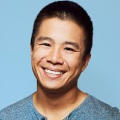

I am a second year statistics PhD student at UC Berkeley.

I also work on web applications and devops automation
in my free time.

You can find me on [Github](https://github.com/feynmanliang)
and [LinkedIn](https://linkedin.com/in/feynman).
